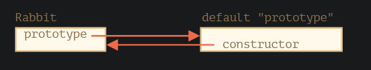

## F.prototype

指的是F的一个名为prototype的常规属性

每个函数都有prototype属性，默认的prototype是一个只有属性constructor的对象，属性constructor指向函数自身

- F.prototype属性，在new F被调用时为新对象的[[prototype]]赋值
- F.prototype属性的值要么是一个对象，要么就是null，其他值都不起作用
- prototype属性仅在设置了一个构造函数，并通过new调用时，才具有这种特殊的影响