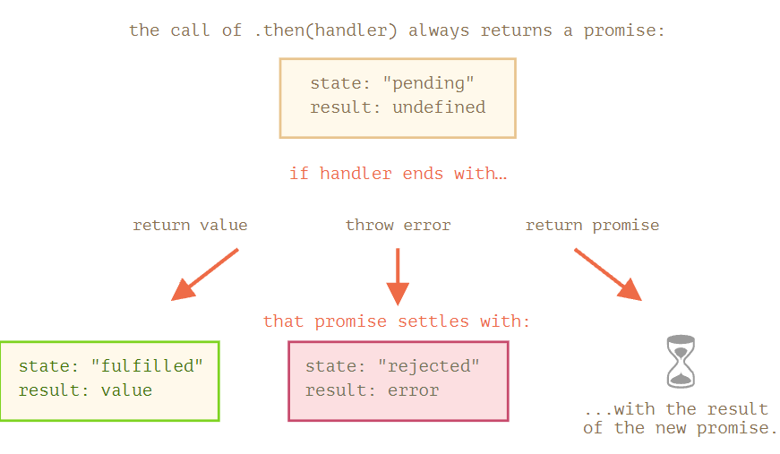

## Promise链

从技术上讲,可以将多个.then添加到一个promise上,但是这不是promise链

### 返回promise

,then中所用的处理程序可以创建并返回一个promise.

在这种情况下,其他的处理程序将等待它settled后再获取其结果

确切的将,处理程序返回的不完全事一个promise,而是返回的被称为thenable对象,一个具有方法.then的任意对象

### 更复杂的示例:fetch

### 总结

