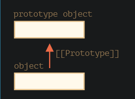

## 原型继承 Prototypal inheritance

### [[Prototype]]

在JavaScript中， 对象有个特殊的隐藏属性[[Prototype]],他要么为null，要么就是对另一个对象的引用，该对象被称为原型。

属性[[Prototype]]是内部的而且还是隐藏的，但是可以使用_proto_设置他。

### 原型链

- 引用不能形成闭环。
- proto的值可以是对象，也可以是null。其他类型的会被忽略
- proto与内部的[[prototype]]不一样，proto是[[prototype]]的getter/setter

### 关于this

无论在哪里找到方法：在一个对象还是在原型中，在一个方法调用中，this始终是点符号前面的对象。

方法是共享的，但是对象状态不是的

###  for ... in 

for.. in 循环也会迭代继承的属性，而Object.keys只会返回自己的key

obj.hasOwbProperty(key)判断obj是否有自己的属性

### 总结

- 在Javascript中，所有的对象都有一个隐藏的prototype属性，他要么是一个对象，要么就是null。
- 写，删除操作直接在对象上进行，他们不使用原型

### 任务

不需要记录，松鼠共用一个胃有点意思

