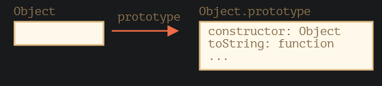
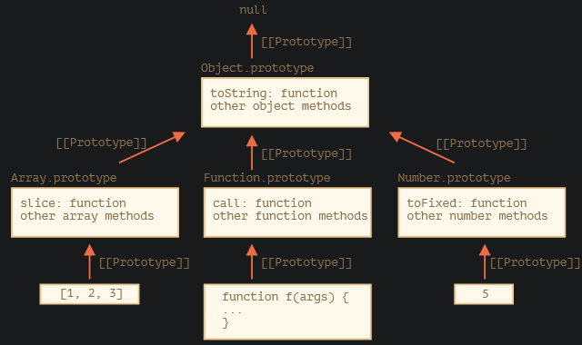

### 原生的原型

#### Object.prototype

### 其他的内建原型

### 基本数据类型

在现代编程中，只有一种情况允许修改原生类型，那就是polyfilling

### 从原型中借用

一次只能继承一个对象

### 总结

所有的内建对象都遵循相同的模式：

- 方法都存储在prototype中
- 对象本身只存储数据

原始数据类型也将方法存储在包装对象的prototype

内建原型可以被修改或则用新的方法填充